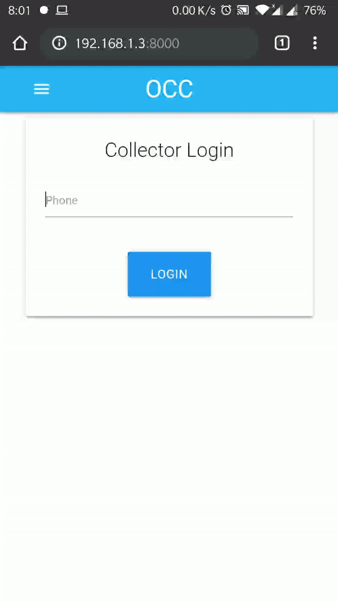

# OfflineCashCollector
- Cash collection system (mobile app + relevant backend structures) 
for field force to do daily cash collection based on Invoice or 
challan amount and foolproof solution to ensure no under collection 
or incorrect representation by cash collection associate or payee 
by using barcode or OTP or self validating TOTP mechanisms. 

- Consider offline (no-connectivity) scenario as well.

- This was built during https://skillenza.com/challenge/kreate-hackathon

# Presentation
https://tinyurl.com/y3ousslv


# How to set it up
1. Clone the repo
```
git clone git@github.com:abhisekpadhi/kreate_hackathon_oct2019.git
```

2. Create virtualenv
```
cd kreate_hackathon_oct2019.git
virtualenv -p python3 venv

```

3. Migrate database changes
```
venv/bin/python manage.py migrate
```

4. Start dev server
```
venv/bin/python manage.py migrate runserver 127.0.0.1:8000
```

# Demo


